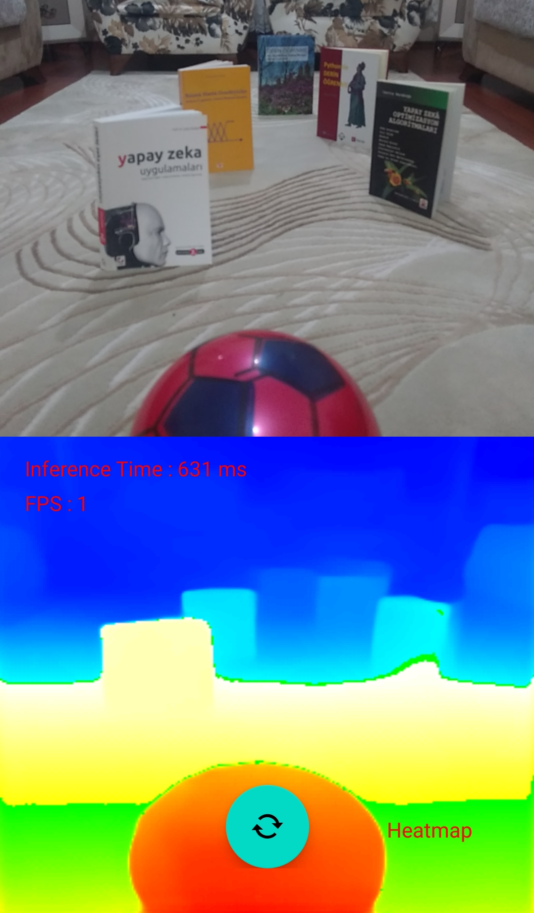
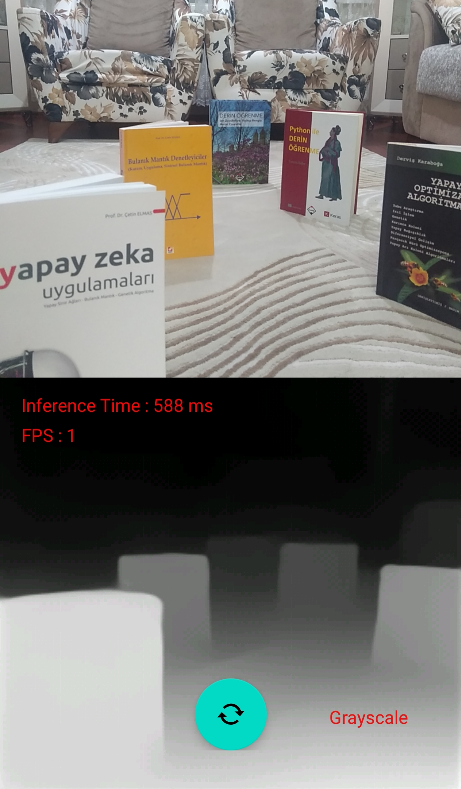
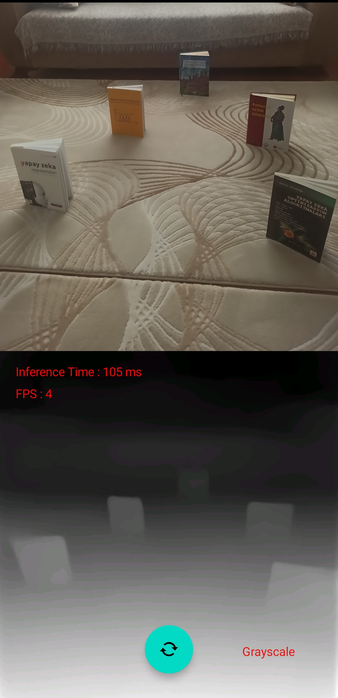
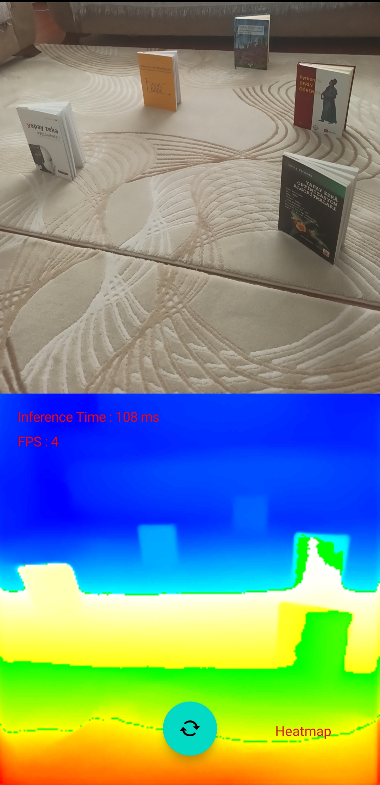
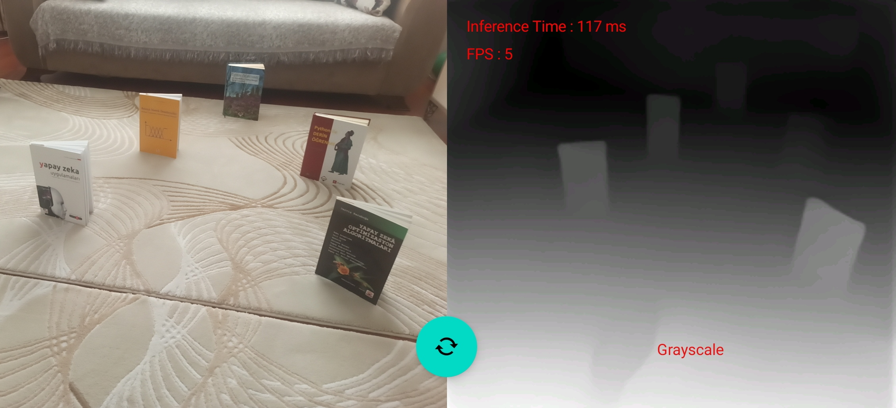
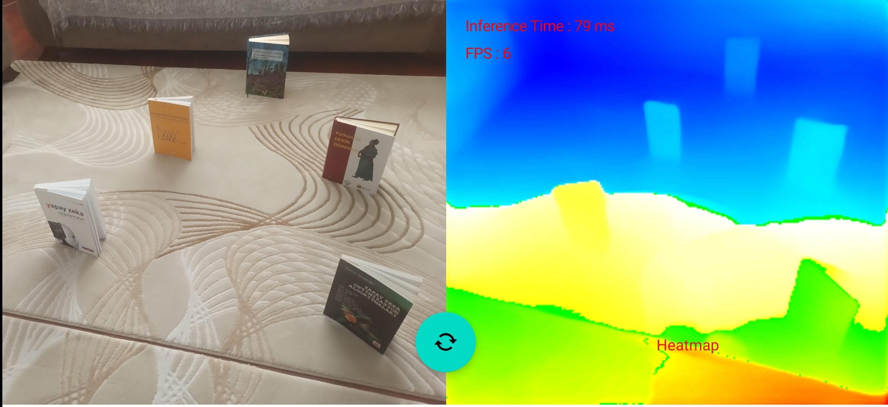

# Monocular Depth Estimation With MiDaS on Android Mobile Devices
This project is developed for the [CMP721 - Computational Photography](http://www.ahmetselman.com/cmp721/index.html) (Fall 2022) PhD course given by [Ahmet Selman Bozkır](http://www.ahmetselman.com) from [Computer Engineering Department](http://cs.hacettepe.edu.tr) at [Hacettepe University](http://hacettepe.edu.tr).

## Introduction
In this project, monocular depth estimation is implemented using pre-trained MiDaS deep learning model. Tensorflow Lite is used as a backend inference engine in the project. The engine uses the [MiDaS](https://github.com/isl-org/MiDaS) v2.1 small as an inference model. The model can be downloaded from model's [Tensorflow Hub page](https://tfhub.dev/intel/midas/v2_1_small/1).

## Performance
The model performance mostly depends on device specifications that run the application. The model tested on two devices detailed in table below:

| **Device**               | **OS**     | **Inference Time (ms)** | **Frame Per Second** |
|--------------------------|------------|-------------------------|----------------------|
| Xiaomi Redmi Note 10 Pro | Android 13 | 90-150                  | 4                    |
| Xiaomi Redmi Note 8 Pro  | Android 11 | 70-80                   | 6                    |
| Lenovo K6 Note           | Android 7  | 500-700                 | 1                    |
| Galaxy A20S              | Android 12 | Android 12              | Android 12           |

## Screenshots

### Lenovo K6 Note
 
 

### Xiaomi Redmi Note 8 Pro
 
 

